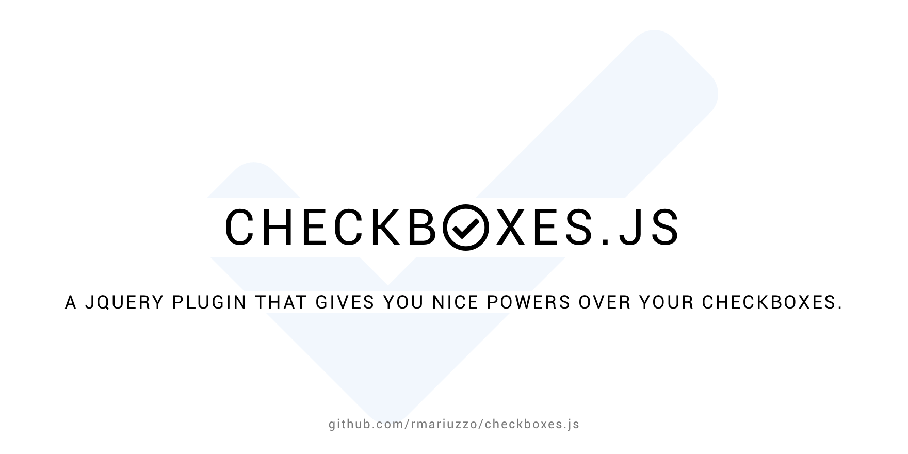

[](https://github.com/rmariuzzo/checkboxes.js/actions/workflows/ci.yml)

## Installation

```shell
npm install checkboxes.js
```

Or download the latest release from [`dist/`](dist/) and include `jquery.checkboxes-###.min.js` just after jQuery.

## Features

 * **Check all** checkboxes in context.
 * **Uncheck all** checkboxes in context.
 * **Toggle states** of all checkboxes in context.
 * Enable **range selection**.
 * **Limit** the number of checked checkboxes per context.
 * **Data API** like Twitter Bootstrap.

### Documentation and examples

 * [Checking all checkboxes in a context](http://rmariuzzo.github.io/checkboxes.js/#checking-all-checkboxes)
 * [Unchecking all checkboxes in a context](http://rmariuzzo.github.io/checkboxes.js/#unchecking-all-checkboxes)
 * [Toggling all checkboxes's state in a context](http://rmariuzzo.github.io/checkboxes.js/#toggling-all-checkboxes)
 * [Enabling range selection of checkboxes](http://rmariuzzo.github.io/checkboxes.js/#range-selection-of-checkboxes)
 * [Limiting the number of checked checkboxes in a context](http://rmariuzzo.github.io/checkboxes.js/#limit-max-number-of-checked-checkboxes)

## Want to contribute?

All help is more than welcome!

#### Pre-requisites

 - [Node.js](https://nodejs.org/) ≥ 20

#### Development Workflow

 1. **[Fork](https://github.com/rmariuzzo/checkboxes.js/fork)** this repository.
 2. **Clone** your fork and create a feature branch.

    ```shell
    git clone git@github.com:<your-username>/checkboxes.js.git
    cd checkboxes.js
    git checkout -b feature-<super-power>
    ```

 3. **Install** dependencies.

    ```shell
    npm install
    ```

 4. **Code** and be happy!
 5. **Lint and test** your code.

    ```shell
    npm run lint
    npm test
    ```

 6. **Build** the distribution files.

    ```shell
    npm run build
    ```

 7. Submit a **pull request** and grab popcorn.

Questions? [Hit me](https://github.com/rmariuzzo/).

## Tests

```shell
npm test
```

### Credits

 - **checkboxes.js** was created by [Rubens Mariuzzo](http://github.com/rmariuzzo) with all the love in the world.

 - **checkboxes.js** would not have been possible without: [jQuery](http://jquery.com/), [Highlight.js](http://softwaremaniacs.org/soft/highlight/en/), [Font Awesome](http://fortawesome.github.io/Font-Awesome/), [Glyphicons](http://glyphicons.com/), [Twitter Bootstrap](http://twitter.github.io/bootstrap/) and [Subtle Patterns](http://subtlepatterns.com/).

## Used by

 - [Patchwork](https://github.com/getpatchwork/patchwork)
